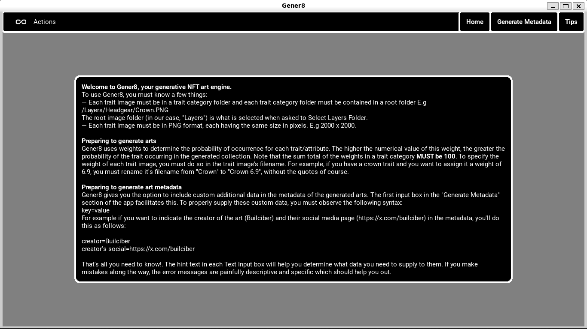

# Gener8: Generative NFT Art Engine

Gener8 is a desktop application with a special focus on ease-of-use and speed that helps artists automate the generation of NFT collection arts. The current version of the MVP is equipped enough to help the artist with simple collection requirements generate their NFT collection art at warp speed — compared to competitors. Artists with special requirements might need to look elsewhere for **now**.

### NOTE
> Gener8's final form is a packaged desktop application. This repository exists to facilitate open-source contributions from devs the world over, but the code therein is functional enough to allow anyone with the slightest programming background to run Gener8 as is to satisfy their needs.

## Using Gener8
Gener8 was built with *ease-of-use* as a core focus. To run this code, you must have Python >=3.9.0 installed.  
Begin by cloning the repository:  
`git clone https://github.com/Builciber/Gener8`  
CD into the cloned respository:  
`cd Gener8`  
Install the required packages:  
`python3 -m pip install -r requirements.txt`  

> As an extra thing to note, *Gener8App.py* contains the backend logic and *gener8.kv* contains the UI code. If there's UI logic that you can't find in *gener8.kv*, it can be found in *Gener8App.py*. If you're a dev wanting to contribute to this repo and you're in need of layers for testing, check out the *layers* folder for arts and an example of how to present your layer images along with their respective weights. The *layers ordering.txt* file specifies the order of layers selection for Gener8's use. You'll enter this ordering in the second text-input box on Gener8's home screen. **The generated output folder named *Gener8 App Output* which contains a GIF, the generated arts, rarity table and will contain the metadata folder when generated, will be written to the same folder that contains your layer images.**

See requirements.txt for required packages and their versions. After neccessary installations, run:
`python3 Gener8App.py` to start the app.

See the image below for app specific usage:  

## Contributing
Contributions are welcome! Please follow these steps:

1. Open an issue to discuss the proposed changes before starting work.
2. Fork the repository.
3. Create a new branch: `git checkout -b feature/your-feature-name`
4. Make your changes and commit them: `git commit -m 'Add some feature'`
5. Push to the branch: `git push origin feature/your-feature-name`
6. Submit a pull request.

When submitting a pull request, please use the provided PR template. For bug reports, please use the bug report template.